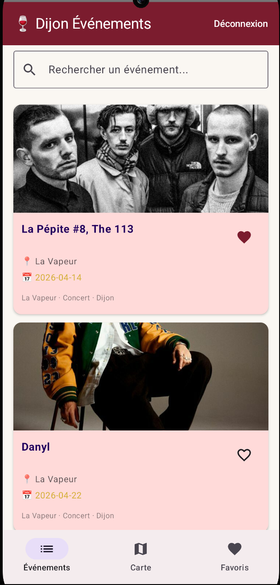
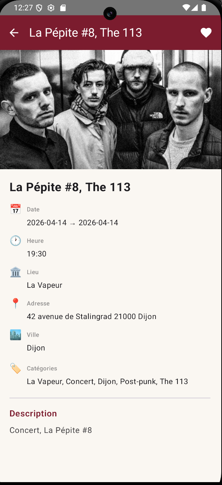
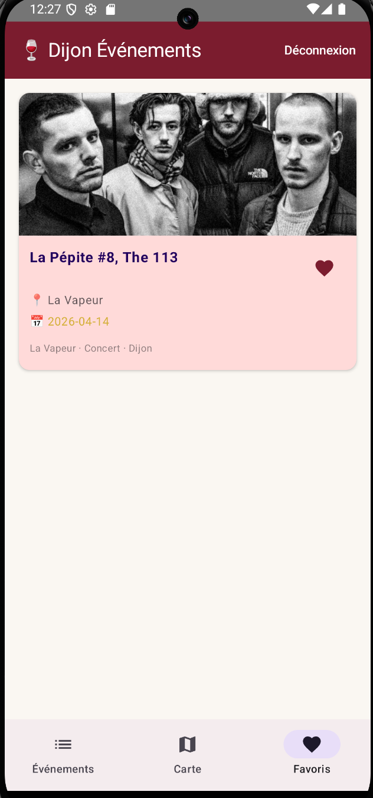
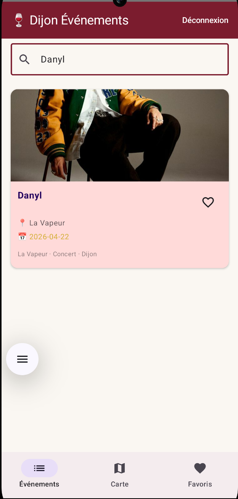
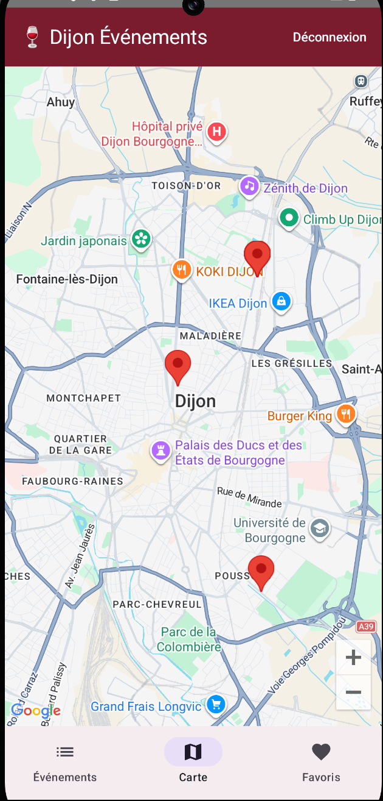

# Dijon Événements — Application Android


-brightgreen?style=flat-square)

Native Android application for discovering cultural events in Dijon and the Burgundy region. Built with Kotlin and Jetpack Compose, following MVVM architecture with Hilt dependency injection.

---

## Screenshots
### Main
This is the main page where you can see all the events


When you click on a card, you can see all the information about an event


You can see all your events added to favourites in the page Favourites


You can search an event by name


You can see more visual where are the events. Don't appear all the events cause some of them dont have latitude and/or longitud, so we can't locate those events in the map.


---

## Problem Statement

Residents and visitors in Dijon lack a unified mobile experience to discover local events — concerts, exhibitions, gastronomic fairs, and cultural gatherings are scattered across multiple websites and platforms.

Dijon Événements solves this by providing a clean native Android app that:
- Aggregates real events from the Dijon Métropole OpenAgenda feed via a dedicated backend
- Shows events on an interactive map centred on Dijon with GPS markers
- Lets authenticated users save favourite events that persist across sessions
- Provides keyword search to quickly find relevant events

---

## Features

### Events
- Browse real cultural events from Dijon and Burgundy
- Search events by keyword in real time
- Tap any event card to see full details: description, location, date, address, categories
- Pull event images from the OpenAgenda CDN

### Map
- Interactive Google Maps view centred on Dijon
- Markers for all events with GPS coordinates
- Tap a marker to preview event details and toggle favourite directly from the map

### Favourites
- Authenticated users can save and remove favourite events
- Favourites persisted in the backend and restored on each login
- Dedicated Favourites tab with the same card UI as the main list

### Authentication
- Register and login with email and password
- JWT token stored securely in DataStore Preferences
- Automatic session restoration on app launch
- Logout clears the local token and redirects to login

---

## Tech Stack

| Layer | Technology | Reason |
|-------|-----------|--------|
| Language | Kotlin 2.0 | Modern, null-safe, idiomatic Android development |
| UI | Jetpack Compose | Declarative UI, current Android standard |
| Architecture | MVVM + Repository pattern | Clean separation of concerns, testable |
| DI | Hilt | Google-recommended DI for Android, reduces boilerplate |
| Navigation | Navigation Compose | Type-safe navigation between screens |
| Networking | Retrofit 2 + OkHttp | Industry-standard HTTP client for Android |
| Serialisation | Moshi + Kotlin Codegen | Faster than Gson, null-safe with Kotlin |
| Auth persistence | DataStore Preferences | Replacement for SharedPreferences, coroutine-native |
| Maps | Maps Compose + Play Services Maps | Native Google Maps in Compose |
| Images | Coil | Coroutine-native image loading for Compose |
| Theme | Material 3 | Modern Material You design system |
| Min SDK | 26 (Android 8.0) | Covers ~95% of active Android devices |

---

## Project Structure

```
dijon-events-android/
├── app/src/main/java/com/adrianmalmierca/dijonevents/
│   ├── DijonEventsApp.kt                   #Hilt Application class
│   ├── MainActivity.kt                     #Entry point + Navigation host
│   ├── data/
│   │   ├── api/
│   │   │   └── DijonEventsApi.kt           #Retrofit interface
│   │   ├── model/
│   │   │   └── Models.kt                   #DTOs (EventDto, AuthResponse, etc.)
│   │   └── repository/
│   │       ├── AuthRepository.kt           #Login/register logic
│   │       ├── EventRepository.kt          #Events and favourites logic
│   │       └── TokenManager.kt             #JWT persistence via DataStore
│   ├── di/
│   │   └── AppModule.kt                    #Hilt module (Retrofit, Moshi, OkHttp)
│   ├── ui/
│   │   ├── auth/
│   │   │   ├── AuthViewModel.kt            #Login/register state
│   │   │   ├── LoginScreen.kt              #Login form
│   │   │   └── RegisterScreen.kt           #Registration form
│   │   ├── events/
│   │   │   ├── EventsViewModel.kt          #Events + favourites state
│   │   │   ├── EventsListScreen.kt         #Main event list with search
│   │   │   ├── EventDetailScreen.kt        #Full event detail view
│   │   │   └── MapScreen.kt               #Google Maps with event markers
│   │   ├── favorites/
│   │   │   └── FavoritesScreen.kt          #User's saved events
│   │   └── theme/
│   │       └── Theme.kt                    #Burgundy/cream Material 3 theme
│   └── util/
│       └── Result.kt                       #Sealed class for async states
├── app/src/main/res/
│   ├── values/
│   │   ├── strings.xml
│   │   └── themes.xml
│   └── xml/
│       └── network_security_config.xml     #Allow HTTP to local backend
├── app/build.gradle.kts                    #App-level Gradle config
├── gradle/libs.versions.toml               #Version catalog
├── local.properties.example               #API keys template
└── build.gradle.kts                        #Root Gradle config
```

---

## Running Locally

### Prerequisites
- Android Studio Hedgehog or later
- Android SDK with API 26+
- A running instance of [evenements-dijon-api](https://github.com/AdrianMalmierca/evenements-dijon-api)
- A Google Maps API key ([obtain here](https://console.cloud.google.com))

```bash
#Clone the repository
git clone https://github.com/AdrianMalmierca/frontend-evenements-dijon-api
cd frontend-evenements-dijon-api

#Set up local properties
cp local.properties.example local.properties
#Fill in sdk.dir and MAPS_API_KEY
```

Open the project in Android Studio and let Gradle sync.

### Environment Variables

In `local.properties`:
```properties
sdk.dir=/Users/your-user/Library/Android/sdk
MAPS_API_KEY=your_google_maps_api_key
```

### Backend URL

The app points to `http://10.0.2.2:8080` by default — this is the Android emulator's address for `localhost` on the host machine. If running on a physical device, update `BASE_URL` in `app/build.gradle.kts`:

```kotlin
buildConfigField("String", "BASE_URL", "\"http://YOUR_LOCAL_IP:8080/\"")
```

### Run

Select an emulator or connected device (API 26+) and press **Run** in Android Studio.

---

## Navigation Flow

```
App Launch
    │
    ├─ Token exists ──► EventsListScreen (bottom nav)
    │                        ├── MapScreen
    │                        ├── FavoritesScreen
    │                        └── EventDetailScreen (on card tap)
    │
    └─ No token ──► LoginScreen
                        └── RegisterScreen
```

---

## Architecture Decisions

### MVVM + Repository Pattern
Each screen has a dedicated `ViewModel` that exposes a single `UiState` as a `StateFlow`. The UI collects this flow and recomposes reactively. Repositories abstract the data sources — the ViewModel never speaks directly to Retrofit or DataStore.

### Hilt for Dependency Injection
Hilt is Google's recommended DI solution for Android. It eliminates manual constructor wiring and makes the dependency graph explicit and testable. The entire Retrofit stack is provided via a single `@Module` in `AppModule.kt`.

### DataStore over SharedPreferences
`DataStore Preferences` is the modern replacement for `SharedPreferences` — it's coroutine-native, type-safe, and handles concurrent access correctly. The JWT token is persisted here and observed as a `Flow<String?>`, which drives the authentication state throughout the app.

### Moshi over Gson
Moshi with Kotlin Codegen generates adapters at compile time rather than using reflection at runtime. This is faster, avoids issues with Kotlin's non-nullable types, and catches serialisation errors at build time instead of at runtime.

### Single Activity + Navigation Compose
The entire app runs in a single `MainActivity`. Navigation between screens is handled by `NavHost` with type-safe route definitions. The bottom navigation bar and top bar are rendered in the `Scaffold` at the root level and conditionally shown based on the current route.

### Material 3 with Burgundy Theme
The colour palette was chosen to reflect the Burgundy/Dijon identity — a deep burgundy primary (`#7B1C2E`) with a gold accent (`#D4AF37`) on a warm cream background. This gives the app a distinctive regional character that reinforces the portfolio positioning.

---

## API Integration

The app communicates exclusively with the `dijon-events-api` backend. All OpenAgenda data is proxied through the backend — the Android app never calls OpenAgenda directly.

```
Android App ──► dijon-events-api ──► OpenAgenda
                     │
                     └──► PostgreSQL (users, favourites)
```

Authentication headers are added per-request in the repository layer using the JWT token from DataStore:

```kotlin
api.getFavorites("Bearer $token")
```

---

## Future Improvements

### Short Term
- **Pull to refresh** — reload events list with swipe gesture
- **Offline support** — cache last fetched events with Room for offline browsing
- **Empty state illustrations** — custom illustrations for empty search results and favourites
- **Error handling UI** — user-friendly error messages instead of raw error strings

### Medium Term
- **Push notifications** — remind users of upcoming favourited events via FCM
- **Filter by category** — chip filters for concert, exposition, sport, gastronomie
- **Event sharing** — share event details via Android share sheet
- **Widgets** — Glance API widget showing next favourited event on the home screen

### Long Term
- **iOS version** — SwiftUI companion app targeting the same backend ([Ledgerly](https://github.com/AdrianMalmierca/ledgerly) demonstrates iOS native skills)
- **Offline-first architecture** — Room + WorkManager sync with background refresh
- **Animations** — shared element transitions between list and detail screens

---

## What I Learned Building This

### Hilt and the Android DI Lifecycle
Hilt's scoping system (`@Singleton`, `@ActivityRetainedScoped`) determines how long a dependency lives. Getting this wrong causes memory leaks or unexpected state resets. The key insight: `ViewModel`s should be scoped to `@ActivityRetainedScoped`, while repositories and network clients should be `@Singleton`.

### JWT State Management with DataStore
Persisting authentication state across app restarts requires observing the DataStore as a `Flow` and connecting it to the navigation graph. The `isLoggedIn` state drives a `LaunchedEffect` that navigates to the appropriate start destination — but this must be handled carefully to avoid navigation loops on recomposition.

### Compose Navigation with Bottom Bar
Keeping the bottom navigation bar in sync with the current route requires using `NavDestination.hierarchy` to match routes correctly, especially when using nested navigation graphs. Using `saveState = true` and `restoreState = true` on `navigate()` preserves the scroll position of each tab.

### Google Maps in Compose
The `maps-compose` library wraps the native `MapView` in a Composable, but lifecycle management is non-trivial. The map must be initialised with the correct `LifecycleOwner` and the `CameraPositionState` must be remembered at the composable level to survive recomposition.

### Retrofit and Coroutines
Retrofit 2.6+ supports `suspend` functions natively — no need for `Call<T>` wrappers. Wrapping each API call in a `try/catch` inside the repository and returning a sealed `Result<T>` class gives the ViewModel a clean way to handle success, error, and loading states without exposing exceptions to the UI layer.

---

## License

MIT — free to use, modify, and deploy.

---

## Author

**Adrián Martín Malmierca**  
Computer Engineer & Mobile Applications Master's Student  
[GitHub](https://github.com/AdrianMalmierca) · [LinkedIn](https://www.linkedin.com/in/adri%C3%A1n-mart%C3%ADn-malmierca-4aa6b0293/)

*Built as a portfolio project targeting the French tech market — ESNs and consulting firms in Burgundy/Dijon.*